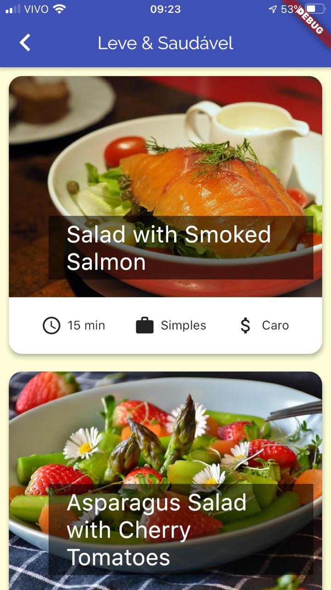

# Meals

## Meals categories, photos and descriptions

A project to study navigations on flutter.

Developed with the flutter course from cod3r.

### Some Widgets

Scaffold

InkWell

Stack

ClipRRect

GridView

ListView.builder()

SingleChildScrollView

FloatingActionButton

CircleAvatar

SwitchListTile.adaptative()

Expanded

### Navigations

Drawer

BottomNavigationBar

BottomNavigationBarItem

.pushNamed()

.pushReplacemetNamed()

.pop()

MaterialApp

routes

onUnknownRoutes

MaterialPageRoute
